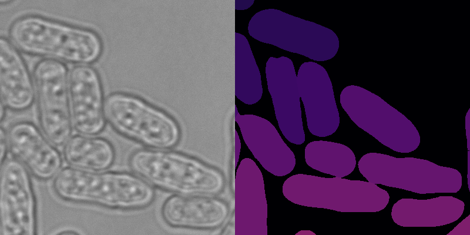

# Cellpose Segmentation

## 📂 Project Overview

The aim of this project was to create a model for segmenting *S. pombe* mutant cells in brightfield imaging. For this, we used [Cellpose](https://cellpose.readthedocs.io/en/latest/index.html) v2.2.3. Cellpose provides several built-in pretrained models that you can use as starting points for your own custom model. In this case, I used the `cyto3` model— a general-purpose model designed for segmenting whole cells. It works well on brightfield, phase contrast, and fluorescence images.  When you train a model in Cellpose, you’re essentially **fine-tuning** an existing pretrained model. This process adjusts the pretrained weights to better segment your specific cell type and imaging conditions.


## 📂 Dataset

Previous experiments have shown that using mean projections of brightfield z-stacks (with a distance of 1 µm between slices) is an effective strategy for segmentation of our cells.  

In this project, we will train **two models** using the same underlying images but with different preprocessing:

- **mean3**: Mean projection of 7 total slices.
- **mean2**: Mean projection of 5 slices.

Each image has a corresponding manually drawn mask, created using a drawing pad. For mask annotation, I recommend using [Napari](https://napari.org/) for its ease of use and precise labeling tools.  

  
**Figure 1. Close-up area of a brightfield mean3 projection with its manually annotated segmentation mask for an S. pombe brightfield images. Each color shade in the segmentation masks correspond to a different annotated label.*

The dataset is organized into:

- **Training images**: Used to teach the model what features correspond to cell masks. *(27 images with corresponding masks)*
- **Test images**: Used to evaluate the model by comparing its predicted segmentations against the ground-truth masks. *(5 images with corresponding masks)*

```
project/
 └── data/
      ├── train/
      │    ├── image_01.tif
      │    ├── image_01_masks.tif
      │    ├── image_02.tif
      │    ├── image_02_masks.tif
      │    └── ...
      └── test/
           ├── image_01.tif
           ├── image_01_masks.tif
           ├── image_02.tif
           ├── image_02_masks.tif
           └── ...
```

All images and masks are pre-aligned and share the same dimensions, ensuring compatibility with Cellpose training workflows.

> 💡 **Tip:** Imaging is not always perfect. To create a more robust model, consider adding perturbations to a small fraction (~10%) of your training set. This helps the model generalize to variations it might see in real data.
> Some ways to do this:  
> - Create mean projections from slightly **unfocused** z-stacks.  
> - Adjust **brightness or contrast** to simulate uneven illumination.  


## ⚙️ Training Command

To train the Cellpose model on the annotated dataset, use the following command:

```bash
python -m cellpose --train \
  --dir ./project/data/train \
  --test_dir ./project/data/test \
  --pretrained_model cyto3 \
  --chan 0 \
  --learning_rate 0.1 \
  --weight_decay 0.0001 \
  --n_epochs 1000 \
  --verbose

### **Explanation of command options**

- **`--train`**  
  Enables training mode in Cellpose.

- **`--dir`**  
  Path to the training images and masks.  
  *Example:* `./project/data/train`

- **`--test_dir`**  
  Path to the test images and masks for validation.  
  *Example:* `./project/data/test`

- **`--pretrained_model cyto3`**  
  Specifies the pretrained model to start from.  
  `cyto3` is used here as the base model for fine-tuning.

- **`--chan 0`**  
  Defines the image channel to use.  
  `0` typically means grayscale / single-channel input.

- **`--learning_rate 0.1`**  
  Sets the learning rate for training.  
  Higher values may train faster but can risk instability.

- **`--weight_decay 0.0001`**  
  Regularization parameter to help prevent overfitting.

- **`--n_epochs 1000`**  
  Number of training epochs (iterations over the entire dataset).

- **`--verbose`**  
  Enables detailed logging output during training.

> 💡 **Tip:** Cellpose expects your input masks files to be named like the images but wiht `_masks` at the end. If you are using different naming scheme, you can add to the command `--mask_filter your_fav_name_for_masks` and you can do the same for the input images `--img_filter fav_images_name`.

## Models evaluation
